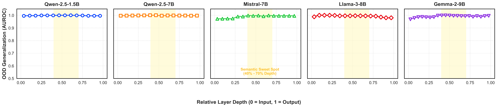
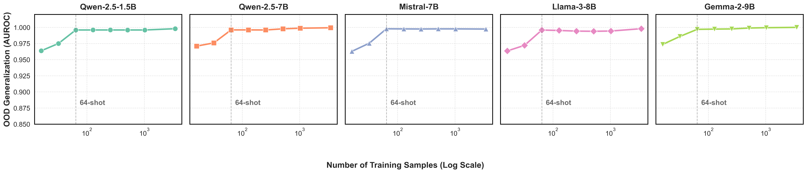

# Supplementary Figures for Rebuttal

We sincerely thank the reviewers for their constructive feedback. To address the concerns regarding figure clarity and overlapping curves, we have redesigned the visualizations into $1 \times 5$ facet grids. 

These figures demonstrate the universality and robustness of the Privacy Manifold across all 5 evaluated LLM families (from 1.5B to 9B parameters).

## 1. Universality of Layer-wise Dynamics 
*Redesigned Figure 2 from the original submission.*
As shown below, the Semantic Sweet Spot (40%-70% depth) are consistent, standalone phenomena across every single model family.

## 2. Sample Efficiency / Few-shot Generalization 
*Redesigned Figure 4(d) from the original submission.*
The learning curves show that the probe achieves extreme sample efficiency, converging to near-optimal performance (>99% AUROC) with as few as 64 training samples across all architectures.

